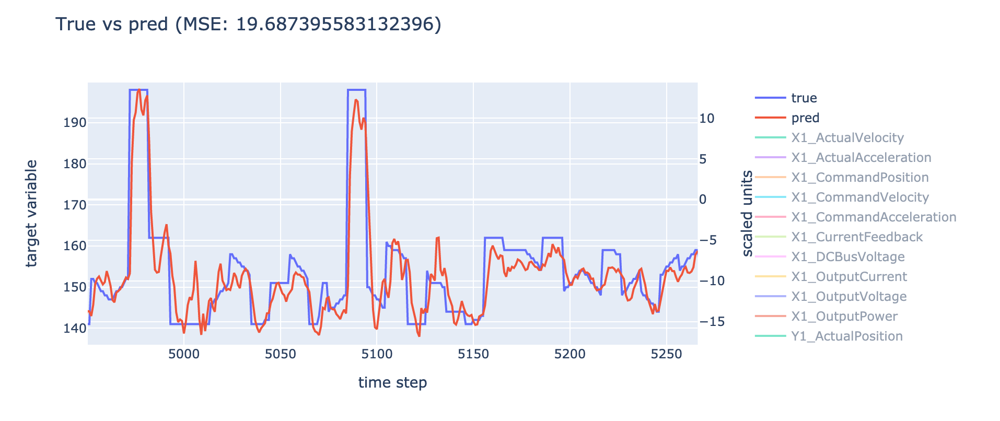
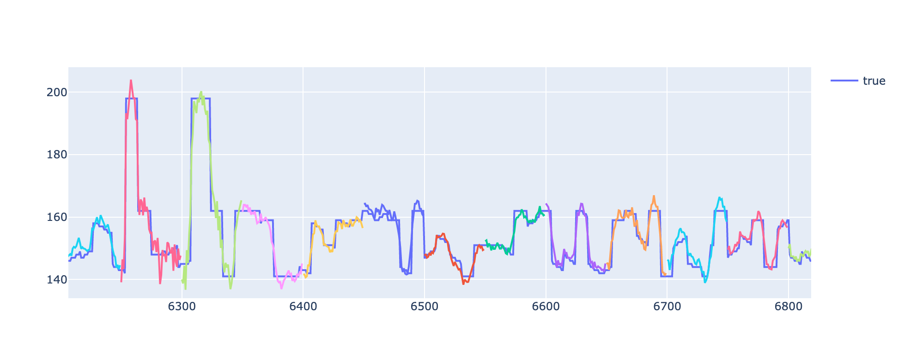

[Documentation - Home](../index.md)

# Quickstart

First, install Erdre and the requirements as specified here:
[Installation](01_installation.md)

To start using Erdre, follow the steps below.

## 1. Setup DVC

There are 2 options when setting up DVC:

### Option A: Simple projects without need for tracking results

Initialize DVC with `dvc init --no-scm`.

The `--no-scm` option specifies that we do not want the DVC-related files to be
tracked by git, because this repository is agnostic to project-specific things
(data files, plots, metrics). This is recommended when there is no need to
track experiments in the repository, for simple projects, testing or developing
of the pipeline itself.


### Option B: Track experiments using git

For long-term projects, it is recommended that you track DVC-related files with
git, to take full advantage of the DVC functionality. Follow these steps:

1. Fork this repository.
2. Remove the lines under `# project-specific files` in .gitignore.
3. Initialize DVC with `dvc init`.

## 2. Add data

To add your data to the pipeline, you have two options:

- Option A: Place the data files in the folder `assets/data/raw/`. 
- Option B: If you want to easily swap between several data sets:
    1. Place the files in a subfolder `assets/data/raw/[NAME OF DATASET]`, where
      `[NAME OF DATASET]` is your chosen name of the data.
    2. In `params.yaml`, set the parameter `dataset` to the name of your data set.

NB: Currently only .csv-files are supported.

Example with a data set called `data01` (option B):

```
assets/
├── data/
|   └── raw/
|       ├── data01/
|       |   ├── experiment_01.csv
|       |   ├── experiment_02.csv
|       |   ├── experiment_03.csv
|       |   ├── ...
|       |   ├── experiment_17.csv
|       |   └── experiment_18.csv
|       └─── README.md
├── metrics/
├── plots/
└── profiling/
```

The data set name is then specified in `params.yaml`:

```
profile:
  dataset: data01

...

```


## 3. Specify parameters

In `params.yaml`, specify the name of the target variable (must match the name
of the column containing the target variable in the data files). Example with
target variable `TargetVar`:

```
clean:
    # target: Name of target variable.
    target: TargetVar
```

The rest of the parameters can also be adjusted. Documentation of the
parameters is found in
[`params.yaml`](https://github.com/SINTEF-9012/Erdre/blob/master/params.yaml).

## 4. Running experiments

Run experiments by executing this command on the main directory:

```
dvc repro
```

On some systems, `dvc` cannot be run as a standalone command, in which case you
will need to run:

```
python3 -m dvc repro
```


To run only parts of the pipeline, run:
```
dvc repro [STAGE NAME]
```

For example:

```
dvc repro profile     # will only run the profiling stage
dvc repro featurize   # will only run the stages up until and including the featurize stage
```


## Example of results

When the trained model is evaluated, the program produces two plots that
visualizes the predictions on the test set. These plots are placed on the
folder `assets/plots/`, and show the following data:

- `prediction.html`: The true target values compared to the predicted target
  values. Only the first value of each target sequence is used in the plot, and
  all of this values are connected and plotted as a line. The features used in
  the model are also plotted.



- `prediction_sequences.html`: Individual predicted target sequences are
  plotted against the true values. The predicted sequences are shown in
  different colors to easily distinguish between them. Only a subset of the
  predicted target sequences are shown, in order to avoid overlapping and make
  the plot easier to interpret.




Next: [Overview of pipeline](03_pipeline.md)
